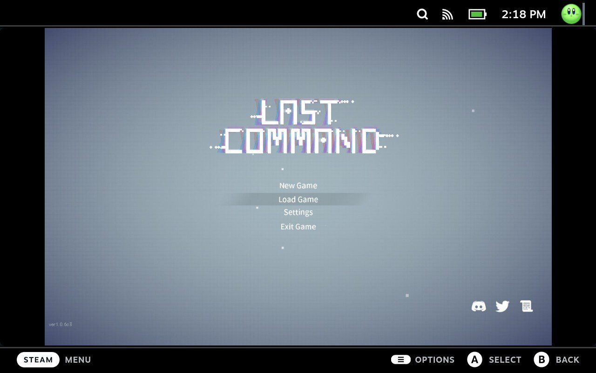

# Steam Deck - View Media in Fullscreen

A Steam Deck Gaming Mode custom CSS theme to display the selected image in
fullscreen when viewing them in Media page.

**Default Media view**

**With this Theme**

## Prerequisite

1. [Decky Loader](https://github.com/SteamDeckHomebrew/decky-loader#installation)
2. [CSS Loader](https://github.com/suchmememanyskill/SDH-CssLoader#installation)

## Installation

### Manual

1. Clone the repo or download the code from [Release](https://github.com/fsworld009/steam-deck-theme-view-media-in-fullscreen/releases)
2. Copy `View Media in Fullscreen` folder to `/home/deck/homebrew/themes/`
3. Open Quick Access Menu -> Decky -> CSS Loader -> Reload themes
4. Turn on `View Media in Fullscreen`

### via CSS Loader

Coming soon...

## Note

If enabling `Delay Effective Time` option, the theme won't apply until about 10
seconds after user enters Media page. See the comment in [source code](./View%20Media%20in%20Fullscreen\patch_global_div.css)
for explanation.

## Development Notes

1. [Minimal theme template](https://github.com/suchmememanyskill/Steam-Deck-Theme-Template/tree/main/Sample%20Simple%20Theme)
   1. There are other templates in the repo
2. [thene.json schema](https://docs.deckthemes.com/#/CSSLoader/README?id=%f0%9f%8e%a8-creating-a-theme)
   1. Or use [Theme Visualizer](https://docs.deckthemes.com/#/CSSLoader/Visualizer?id=visualizer)
3. On PC, open Steam client with `-dev -gamepadui`
5. Hit F12 to open Dev console to inspect HTML and test CSS overrides
5. Note that each dev console targets different views, which you need to set
   in `inject` section in theme.json:
   1. SP: Main window
   2. MainMenu: Pop up menu on the left
   3. QuickAccess: Pop up menu on the right
6. Use Manual installation step to test the theme on Steamdeck
